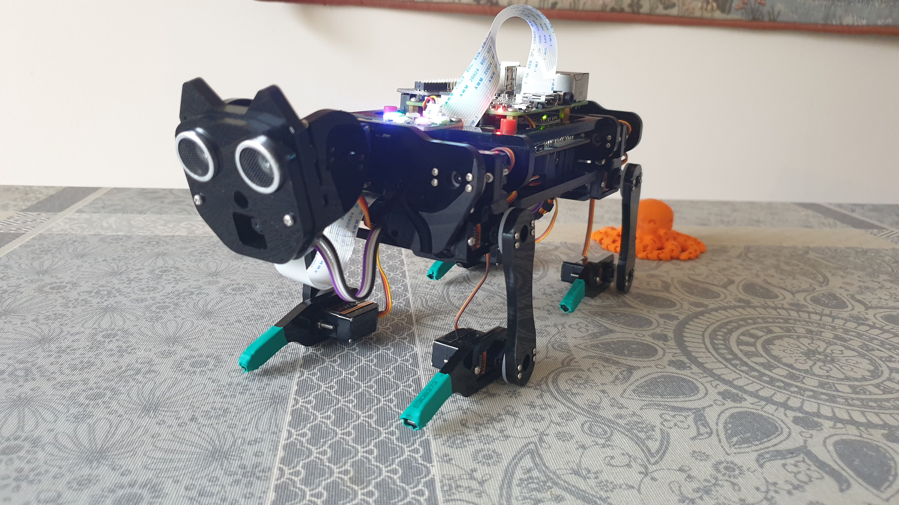
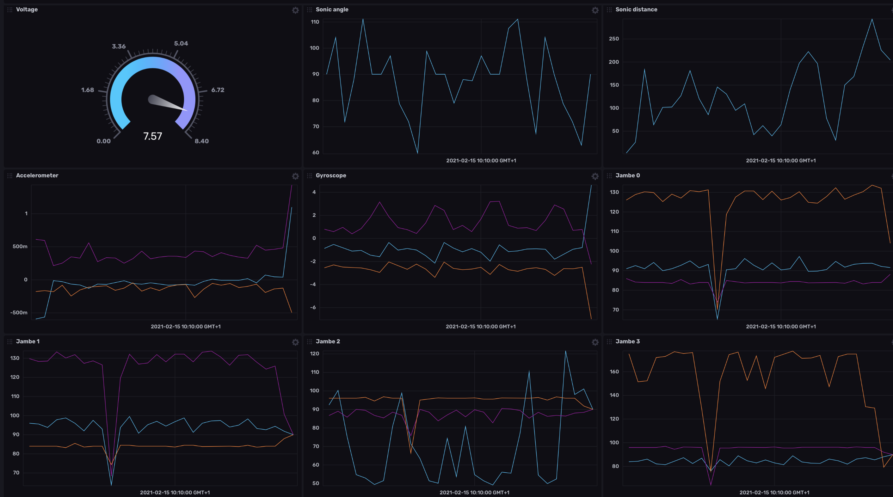
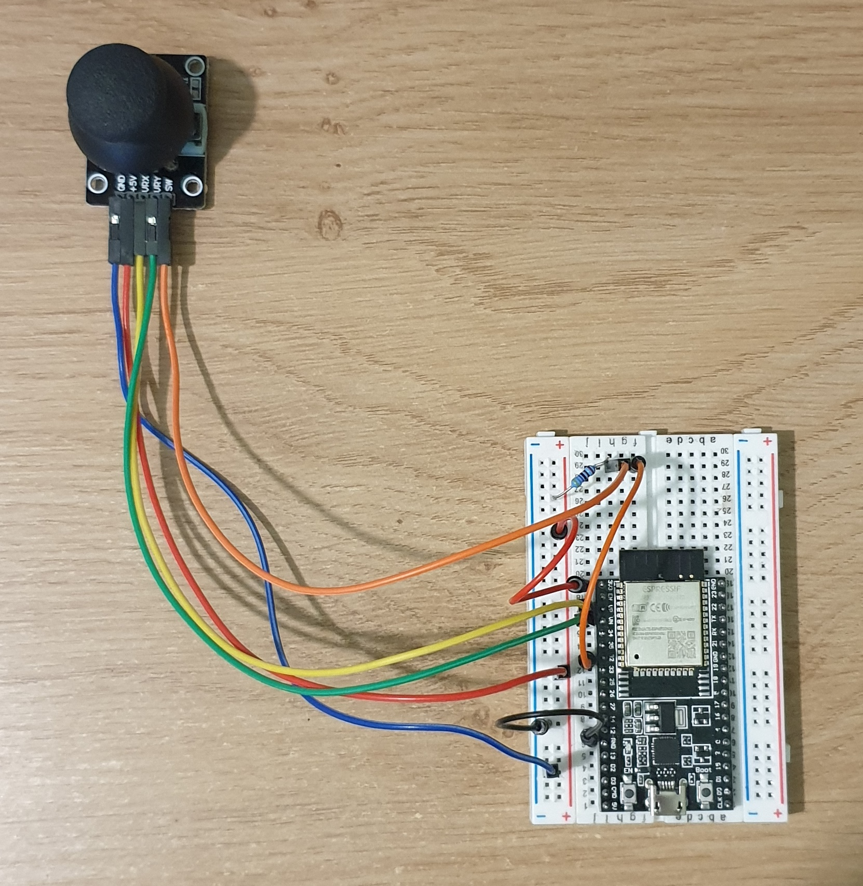

# FreeNove RobotDog

Projet de fin d'études réalisé avec la collaboration de Florian Boisnon et de Blaise Prevost.
L'objectif du projet est de créer une collaboration entre des robots et d'ajouter des fonctionnalités.

    

## Suivi en temps réel

    

## ESP32, JOYSTICK et Bluetooth Low Energy

    

